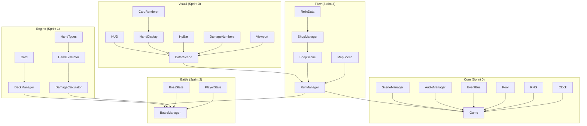

# Sprint 0–4 完成報告

## 測試與編譯結果

```
 ✓ tests/rng.test.ts              (10 tests)   ✅
 ✓ tests/hand-evaluator.test.ts   (14 tests)   ✅
 ✓ tests/damage-calculator.test.ts (9 tests)   ✅
 ✓ tests/deck-manager.test.ts     (11 tests)   ✅
 ✓ tests/battle-manager.test.ts   (12 tests)   ✅

 Tests:  56 passed (56) | TypeScript: 0 errors | Duration: 307ms
```

---

## 架構圖



---

## Sprint 4 新增內容

### 系統層
| 檔案 | 說明 |
|------|------|
| [relics.ts](file:///Users/chinqan-mac/Balatro/src/data/relics.ts) | 12 個遺物定義 (4 稀有度 × 結構化效果) |
| [shop-manager.ts](file:///Users/chinqan-mac/Balatro/src/systems/shop-manager.ts) | 商店系統 (庫存/購買/Reroll/獎勵) |
| [run-manager.ts](file:///Users/chinqan-mac/Balatro/src/systems/run-manager.ts) | 地城流程 (8F × 3 遭遇) |

### 場景層
| 檔案 | 說明 |
|------|------|
| [map-scene.ts](file:///Users/chinqan-mac/Balatro/src/scenes/map-scene.ts) | 地城地圖 (8 樓 × 3 節點 + 跳過按鈕) |
| [shop-scene.ts](file:///Users/chinqan-mac/Balatro/src/scenes/shop-scene.ts) | 商店畫面 (遺物卡/購買/Reroll/離開) |

### 更新檔案
| 檔案 | 變更 |
|------|------|
| [types/index.ts](file:///Users/chinqan-mac/Balatro/src/types/index.ts) | RelicDefinition 擴充 (tier/price/effect) |
| [event-bus.ts](file:///Users/chinqan-mac/Balatro/src/core/event-bus.ts) | +4 run flow 事件類型 |
| [battle-scene.ts](file:///Users/chinqan-mac/Balatro/src/scenes/battle-scene.ts) | 支援外部 BattleManager 注入 |
| [game.ts](file:///Users/chinqan-mac/Balatro/src/game.ts) | 完整 map→battle→shop→map 循環 |

---

## 完整遊戲流程

```
┌──────────┐   開始戰鬥   ┌────────────┐   勝利   ┌──────────┐
│ 地城地圖  │ ──────────→ │   戰鬥場景   │ ──────→ │   商店    │
│ (MapScene)│             │(BattleScene)│         │(ShopScene)│
└──────────┘             └────────────┘         └──────────┘
     ↑                        │                      │
     │                    敗北 │              離開商店 │
     │    ┌──────────────┐    ↓                      │
     │    │  Game Over    │←──┘                      │
     │    └──────────────┘                           │
     └───────────────────────────────────────────────┘
```

## 下一步：Sprint 5+ — 內容填充 + 打磨

- 150 神器效果實作
- 消耗品 (捲軸/靈藥/契約) 效果
- Boss 機制限制 (花色封鎖, 牌型封鎖, etc.)
- Shader 特效、音效連鎖、動態音樂
- 存檔/讀檔 + Meta 進度
