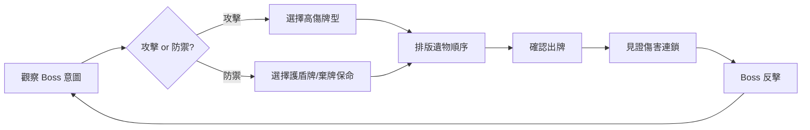

# Phase 4: 介面與體驗設計

**負責 Agent**: ✨ UI Designer + 🧩 UX Architect
**Skill**: `balatro-ui-designer` + `balatro-ux-architect`

---

## 1. 戰鬥介面佈局

### 1.1 主戰鬥畫面配置

```
┌─────────────────────────────────────────────┐
│  [F2 🛡️菁英怪]  [Boss 名稱]  [Boss HP ████████░░] │  ← 頂部
│  [Boss 攻擊意圖: ⚔️ 30 DMG]               │
│                                             │
│           ╔══════════════╗                  │
│           ║   Boss 立繪   ║                  │  ← 中央
│           ╚══════════════╝                  │
│                                             │
│  [遺物1][遺物2][遺物3][遺物4][遺物5]  [🧪1][🧪2] │  ← 遺物欄 + 消耗品欄
│                                             │
│  ┌────┐┌────┐┌────┐┌────┐┌────┐           │  ← 手牌區
│  │ 5♠ ││ K♥ ││ A♦ ││ 7♣ ││ 3♠ │           │
│  └────┘└────┘└────┘└────┘└────┘           │
│              [🔀 排序: 數字 ▾]               │  ← 排序切換鈕
│                                             │
│  [出牌:4] [棄牌:3]  [玩家 HP:100] [🛡️:0]  │  ← 底部
│  [💰 12]                    [出牌] [棄牌]  │  ← 底部
│  [📋 Run Info] [🃏 牌庫查看]                │  ← 資訊按鈕
└─────────────────────────────────────────────┘
```

> [!NOTE]
> **手牌排序**：手牌區下方提供一個排序切換按鈕，點擊可在「數字」與「花色」之間切換。**手牌始終處於排序狀態**，預設為「數字」排序。數字排序按點數降序排列，同點數中按花色分組（♠♥♦♣）；花色排序按 ♠♥♦♣ 順序，同花色中按點數降序。不存在「無排序」狀態。

### 1.2 資訊層級金字塔

| 層級 | 始終顯示 | 內容 |
|:----:|:-------:|------|
| 1 | ✅ | 關卡資訊（F2 🛡️菁英怪）+ Boss HP 條 + 玩家 HP 條 |
| 2 | ✅ | 手牌 + 遺物欄 |
| 2.5 | ✅ | 消耗品欄位（遺物欄右側，顯示圖標+數量） |
| 3 | ✅ | 出牌/棄牌次數 + 金錢 |
| 4 | 懸停 | Boss 攻擊意圖詳情 |
| 5 | 懸停 | 卡牌/遺物/消耗品的能力說明 |
| 6 | 按鈕 | 牌庫組成查看器（花色/點數分佈） |
| 7 | 按鈕 | Run Info → 牌型等級儀表板 |

---

## 2. 視覺設計系統

### 2.1 色彩系統

| 屬性 | 主色 | 用途 |
|------|:----:|------|
| 攻擊力 (ATK) | `#4A9EFF` 藍 | ATK 數字、ATK 型遺物邊框 |
| 傷害倍率 (DMG) | `#FF4A5E` 紅 | DMG 數字、DMG 型遺物邊框 |
| 護盾 (Shield) | `#4AFF7A` 綠 | Shield 數字、DEF 型遺物 |
| 金錢 ($) | `#FFD700` 金 | 金錢數字、經濟型遺物 |
| 回復 (Heal) | `#FFFFFF` 白 | HP 回復數字 |
| Boss 傷害 | `#FF0000` 深紅 | Boss 造成的傷害數字 |

### 2.2 稀有度視覺

| 稀有度 | 邊框色 | 背景效果 |
|--------|:-----:|---------|
| 普通 | 藍 | 無 |
| 罕見 | 綠 | 微光粒子 |
| 稀有 | 紅 | 脈動光暈 |
| 傳奇 | 紫金漸層 | 持續旋轉光環 |

---

## 3. 戰鬥動畫 Juice 規格

### 3.1 傷害演出時間軸

```
[出牌確認]
  ↓ 0ms    牌型判定 + 基礎傷害數字浮出
  ↓ 200ms  第1張牌飛向Boss（拋物線+旋轉）→ 衝擊 → ATK數字彈出
  ↓ 400ms  第2張牌飛向Boss → 衝擊 → 數字彈出 → Pitch升高
  ↓ ...    逐張結算（間隔 200ms）
  ↓ +200ms 手中留牌光環閃爍（鋼鐵牌 ×1.5 DMG 字樣）
  ↓ +400ms 遺物由左至右依序亮起 → 加成數字飛出
  ↓ +300ms 最終傷害數字「砸」向 Boss HP 條
  ↓ +200ms Boss HP 條扣減動畫 + Boss 受擊動畫
  ↓ +500ms 畫面恢復 → Boss 回合開始
```

### 3.2 Boss 受擊動畫分級

| 傷害占比 (÷ Boss 總 HP) | 動畫等級 | 表現 |
|:----------------------:|:-------:|------|
| < 5% | 微傷 | 輕微抖動 |
| 5% - 20% | 重擊 | 大幅後仰 + 畫面震動 |
| 20% - 50% | 暴擊 | 畫面白屏閃爍 + 碎裂特效 |
| > 50% | 毀滅 | 慢動作 + 火焰爆炸 + 全屏震動 |

### 3.3 消耗品使用動畫時間軸

```
[點擊消耗品]
  ↓ 0ms    消耗品圖標放大 1.2x + 發光邊框
  ↓ 150ms  （若需目標）手牌區進入「目標選擇模式」— 可選牌亮起，不可選牌暗淡
  ↓        玩家點選目標牌 → 目標牌上移 + 確認提示
[確認使用 / 自動執行（無目標類）]
  ↓ 0ms    消耗品從欄位飛向目標（拋物線軌跡）
  ↓ 200ms  觸發特效動畫（對應 trigger_vfx）+ 音效（trigger_sfx_id）
  ↓ 400ms  效果數字浮出（「+1 Lv.」「♠→♥」「-20 HP」等）
  ↓ 300ms  消耗品欄位消失動畫（縮小 + 淡出）
  ↓ 200ms  畫面恢復，玩家可繼續操作
```

> [!NOTE]
> 消耗品使用動畫總時長 ≈ 1.1 秒（無目標）或 1.1 秒 + 玩家選擇時間（有目標）。比傷害結算短，保持戰鬥節奏。

---

## 4. 決策流程與資訊架構

### 4.1 攻防決策循環



---

## 5. 心流與再來一局

| 機制 | 規格 |
|------|------|
| Boss 擊敗勝利演出 | Boss 碎裂 → 獎勵灑落 → 勝利音效 → ≤ 3 秒 |
| 玩家死亡 → 重啟 | 死亡動畫 → 統計閃現 → 「再來一局」按鈕 → ≤ 5 秒 |
| 懸念設計 | 不預覽最終傷害數字，讓玩家享受連鎖計算的「發現」感 |

---

## 6. 卡牌視覺狀態分層系統 (Card Visual State Layering)

每張撲克牌最多可同時疊加 4 層視覺效果：

### 渲染順序（嚴格後畫壓前畫）

| 層級 | 名稱 | 內容 | PIXI 實作 |
|:----:|------|------|----------|
| 1 | 增強 (Enhancement) | 底紋材質（玻璃=透明裂紋、鋼鐵=金屬光澤等） | `PIXI.Sprite` 底層貼圖 |
| 2 | 版本 (Edition) | Shader 效果（閃箔粒子、全像彩虹、負片反色） | `PIXI.Filter` (GLSL) |
| 3 | 封印 (Seal) | 封蠟圖標（紅/藍/金/紫，帶微動畫） | `PIXI.Sprite` + 位移動畫 |
| 4 | 觸發 (Trigger VFX) | 計分時動態（發光、閃光波、碎裂、旋轉飛走） | `PIXI.Container` 粒子 |

> [!IMPORTANT]
> 增強底紋 → 版本 Shader → 封印圖標 → 觸發動畫。四層不可亂序，否則會出現視覺穿幫。
