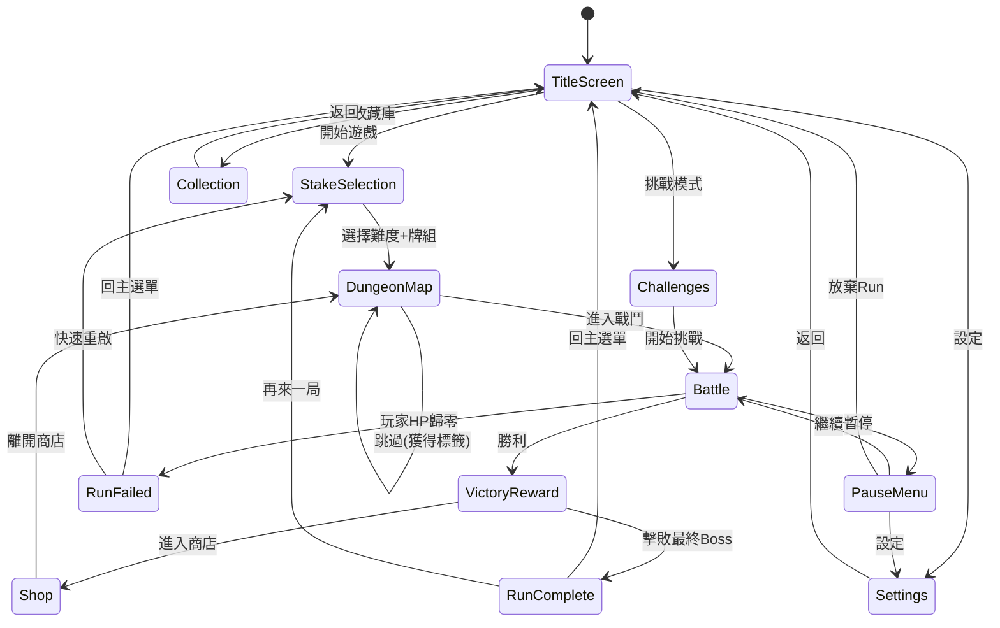

# Phase 8: 遊戲流程與畫面操作規格

**負責 Agent**: ✨ UI Designer + 🧩 UX Architect
**Skill**: `balatro-ui-designer` + `balatro-ux-architect`

---

## 1. 畫面流程圖 (Screen Flow Diagram)

### 1.1 完整狀態轉換圖



### 1.2 過場動畫規格

| 轉場 | 動畫類型 | 時長 |
|------|---------|:----:|
| 主選單 → 遊戲 | 漸黑淡出 → 淡入 | 600ms |
| 地圖 → 戰鬥 | Boss 名字滑入 + 機制限制顯示 | 1200ms |
| 戰鬥 → 勝利 | Boss 碎裂 → 獎勵灑落 | 1500ms |
| 戰鬥 → 失敗 | 畫面碎裂 → 變暗 | 800ms |
| 商店 ↔ 地圖 | 左右滑動 | 400ms |

---

## 2. 主選單與進入遊戲

### 2.1 主選單 (Title Screen)

```
┌─────────────────────────────────┐
│                                 │
│       BOSS-ATTACK RPG           │  ← 標題 + 背景動畫
│                                 │
│       [ 開始新局 ]              │
│       [ 繼續遊戲 ]  (灰色若無存檔)│
│       [ 收藏庫   ]              │
│       [ 挑戰模式 ]  (解鎖後顯示) │
│       [ 設定     ]              │
│                                 │
│              v1.0.0             │
└─────────────────────────────────┘
```

- **背景動畫**：CRT 靜態噪點 + 慢速旋轉卡牌
- **BGM**：Pad Stem 100% + 低音量 FX

### 2.2 難度選擇 (Stake Selection)

- 水平滑動選擇 8 個賭注等級
- 未解鎖的等級顯示鎖頭圖標 + 解鎖條件文字
- 下方同時選擇**起始牌組**（水平捲動 15+ 種牌組）
- 確認按鈕：「挑戰 [Boss名] — [賭注名]」

### 2.3 地城地圖 (Dungeon Map)

- 垂直捲動的路徑圖（從底部到頂部 = Floor 1 → Floor 8）
- 每個節點：遭遇類型圖標（劍=普通、盾=菁英、骷髏=Boss）
- 岔路：某些樓層有 2 條路線（風險 vs 安全）
- Boss 節點：顯示 Boss 名稱 + 已知機制限制

---

## 3. 戰鬥中玩家操作細節

### 3.1 手牌操作

| 操作 | 方式 | 回饋 |
|------|------|------|
| 選牌 | 點擊卡牌 → 卡牌上移 15px + 發光邊框 | 選取音效 |
| 取消選擇 | 再次點擊已選卡牌 | 卡牌回落 + 取消音效 |
| 拖曳排序 | 長按拖動 → 其他牌自動讓位 | 滑動音效 |
| 確認出牌 | 點擊「出牌」按鈕（≥1 張牌被選中時亮起）| 出牌確認音 |
| 棄牌 | 點擊「棄牌」按鈕 → 選中的牌飛入棄牌堆 | 棄牌音效 |

### 3.2 遺物操作

- 拖動遺物可重新排列順序（影響結算順序）
- 懸停遺物會顯示能力說明浮窗
- 被沉默的遺物顯示灰色 + 鎖鏈圖標

### 3.3 Boss 意圖查看

- Boss 上方始終顯示下一回合攻擊意圖圖標
- 點擊/懸停圖標 → 展開詳細說明（傷害值、Debuff 類型）

### 3.4 商店操作

| 操作 | 方式 |
|------|------|
| 購買 | 點擊商品 → 確認彈窗 → 金錢扣除動畫 |
| 售出遺物 | 拖動遺物至售出區 → 顯示售價 → 鬆手確認 |
| 重新整理 | 點擊 Reroll 按鈕（費用 5 金） → 商品重新生成 |
| 離開商店 | 點擊「下一場」→ 返回地城地圖 |

---

## 4. 結算與重啟畫面

### 4.1 戰鬥勝利結算

```
順序：Boss 碎裂(1s) → 金錢灑落(0.5s) → 獎勵卡片翻面(1s) → 「繼續」按鈕
```

### 4.2 Run 失敗結算

```
順序：死亡動畫(0.5s) → 統計面板滑入(0.5s)
  - 本局最高單次傷害
  - 總造成傷害
  - 擊敗 Boss 數
  - 使用最多牌型
  - 最終樓層
  [快速重啟] [回主選單]
```

### 4.3 Run 完成（全通關）結算

- 展示完整統計 + 本局種子碼
- 若觸發新解鎖：彈出「新內容解鎖！」動畫
- 時間 ≤ 5 秒即可點擊跳過

---

## 5. 輔助畫面

### 5.1 暫停/設定

- **主音量 / SFX / BGM**：滑桿
- **CRT 效果**：開/關
- **減少動態**：開/關
- **色弱模式**：無/紅綠/藍黃
- **UI 縮放**：1.0x / 1.5x / 2.0x
- **退出確認**：「放棄本局？」是/否

### 5.2 收藏庫/圖鑑

- 分頁：神器 | 捲軸 | 靈藥 | 契約 | 永久加持
- 已發現：彩色顯示 + 能力說明
- 未發現：灰色剪影 + 「???」
- 進度條：已發現 / 總數

### 5.3 新手教學

- **觸發條件**：首次遊戲自動啟動（可跳過）
- **分步引導**：
  1. 「這是你的手牌」→ 高亮手牌區
  2. 「選擇卡牌並出牌」→ 引導選擇 + 點擊出牌
  3. 「觀察傷害連鎖」→ 自動播放一次結算動畫
  4. 「Boss 會反擊」→ 展示 Boss 攻擊意圖
  5. 「在商店強化自己」→ 引導購買一個遺物
