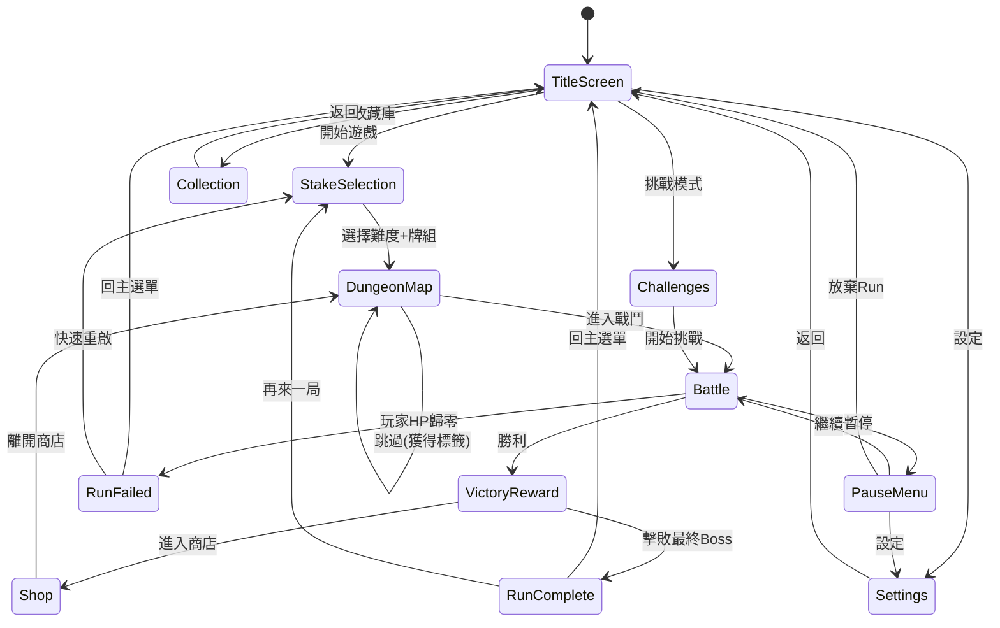

# Phase 8: 遊戲流程與畫面操作規格

**負責 Agent**: ✨ UI Designer + 🧩 UX Architect
**Skill**: `balatro-ui-designer` + `balatro-ux-architect`

---

## 1. 畫面流程圖 (Screen Flow Diagram)

### 1.1 完整狀態轉換圖



### 1.2 過場動畫規格

| 轉場 | 動畫類型 | 時長 |
|------|---------|:----:|
| 主選單 → 遊戲 | 漸黑淡出 → 淡入 | 600ms |
| 地圖 → 戰鬥 | Boss 名字滑入 + 機制限制顯示 | 1200ms |
| 戰鬥 → 勝利 | Boss 碎裂 → 獎勵灑落 | 1500ms |
| 戰鬥 → 失敗 | 畫面碎裂 → 變暗 | 800ms |
| 商店 ↔ 地圖 | 左右滑動 | 400ms |

---

## 2. 主選單與進入遊戲

### 2.1 主選單 (Title Screen)

```
┌─────────────────────────────────┐
│                                 │
│       BOSS-ATTACK RPG           │  ← 標題 + 背景動畫
│                                 │
│       [ 開始新局 ]              │
│       [ 繼續遊戲 ]  (灰色若無存檔)│
│       [ 收藏庫   ]              │
│       [ 挑戰模式 ]  (解鎖後顯示) │
│       [ 設定     ]              │
│                                 │
│              v1.0.0             │
└─────────────────────────────────┘
```

- **背景動畫**：CRT 靜態噪點 + 慢速旋轉卡牌
- **BGM**：Pad Stem 100% + 低音量 FX

### 2.2 難度選擇 (Stake Selection)

- 水平滑動選擇 8 個賭注等級
- 未解鎖的等級顯示鎖頭圖標 + 解鎖條件文字
- 下方同時選擇**起始牌組**（水平捲動 15+ 種牌組）
- 確認按鈕：「挑戰 [Boss名] — [賭注名]」

### 2.3 地城地圖 (Dungeon Map)

#### 地圖 ASCII 佈局

```
┌─────────────────────────────────────────────┐
│  Floor 8    [💀 The End]                    │  ← 最頂部（最終 Boss）
│               │                             │
│  Floor 7    [💀 The Scale]                  │
│               │                             │
│  Floor 6    [💀 The Void]                   │
│               │                             │
│  Floor 5  ┌─[⚔️]─┐                         │  ← 岔路（風險 vs 安全）
│           │      │                          │
│         [💀]   [🎁]                         │  ← Boss or 寶箱岔路
│           └──┬──┘                           │
│  Floor 4    [💀 The Chain]                  │
│               │                             │
│  Floor 3  ┌─[⚔️]─┐                         │
│           │      │                          │
│         [🛡️]   [🎁]                         │  ← 菁英怪 or 寶箱
│           └──┬──┘                           │
│  Floor 2    [🛡️]──[💀 The Mask]            │
│               │                             │
│  Floor 1    [⚔️]──[⚔️]──[💀 The Gate]      │  ← 當前位置（底部）
│            ← 你在這裡                       │
├─────────────────────────────────────────────┤
│  Floor 1 / 8      賭注: 紅注               │  ← 底部 HUD
│  [📋 Run Info]    💰 12 金                  │
└─────────────────────────────────────────────┘
```

#### 節點類型與圖標

| 圖標 | 類型 | 說明 | 可否跳過 |
|:----:|------|------|:-------:|
| ⚔️ | 普通怪 | HP 低、無特殊機制 | ✅ 可跳過 |
| 🛡️ | 菁英怪 | HP 中等、帶 1 個機制限制 | ✅ 可跳過 |
| 💀 | 守關 Boss | HP 高、帶 2-3 個機制 + 攻擊模式 | ❌ 不可跳過 |
| 🎁 | 寶箱岔路 | 跳過菁英怪時的替代路線 | — |
| 🏪 | 商店 | 每場戰鬥後自動進入 | — |
| 🔒 | 未探索 | 尚未到達的節點（灰色） | — |
| ✅ | 已通過 | 已擊敗的節點（標記完成） | — |

#### 跳過操作與獎勵互動

| 操作 | 方式 | 回饋 |
|------|------|------|
| 查看節點 | 點擊/懸停節點 → 顯示怪物資訊浮窗 | 浮窗：HP/機制限制/預估獎勵 |
| 進入戰鬥 | 點擊節點 →「挑戰」按鈕 | Boss 名字滑入 + 機制限制顯示（1200ms） |
| 跳過普通怪 | 點擊「跳過」→ 確認彈窗 | 顯示放棄內容 vs 獲得內容 |
| 跳過菁英怪 | 點擊「跳過」→ 確認彈窗 | 顯示放棄內容 vs 獲得內容（含寶箱岔路選項） |
| 選擇岔路 | 岔路節點出現時選擇路線 | 路線高亮 + 風險提示 |

#### 跳過確認彈窗規格

```
┌─────────────────────────────────────┐
│        ⏭️ 跳過此戰鬥？             │
│                                     │
│  ❌ 放棄:                           │
│   • 戰鬥金錢獎勵（~5 金）          │
│   • 戰後商店機會                    │
│                                     │
│  ✅ 獲得:                           │
│   • 🏷️ 隨機標籤（一次性增益）       │
│   ┌────────────────────┐            │
│   │  🏷️ [???]          │            │  ← 標籤面朝下
│   │  效果：獲得後揭曉   │            │
│   └────────────────────┘            │
│                                     │
│   [ 確認跳過 ]    [ 返回 ]          │
└─────────────────────────────────────┘
```

> [!NOTE]
> **標籤獲得動畫**：確認跳過後，標籤卡片翻面（0.5s）→ 展示效果（如「經濟標籤 +10 金」）→ 效果立即生效。若跳過菁英怪，可能出現寶箱岔路選項替代標籤。

#### 跳過獎勵詳細表

| 跳過類型 | 放棄的 | 獲得的 | 標籤池 |
|---------|-------|-------|--------|
| 跳過普通怪 | 3-5 金 + 商店 | 1 個隨機標籤 | 經濟/靈藥/稀有（等權重） |
| 跳過菁英怪 | 5-7 金 + 商店 | 1 個稀有標籤 **或** 寶箱岔路 | 負片/挑戰/稀有（較強） |

#### 寶箱岔路規格

跳過菁英怪時有 **30% 機率**觸發寶箱岔路（替代標籤獲得）：

| 寶箱類型 | 內容 | 出現率 |
|---------|------|:-----:|
| 銅寶箱 | 1 件隨機消耗品 | 50% |
| 銀寶箱 | 1 件隨機遺物（普通-罕見） | 35% |
| 金寶箱 | 1 件稀有遺物 + 5 金 | 15% |

#### Boss 預覽互動

點擊地圖上的 Boss 節點 💀 時，展開 Boss 挑戰預覽面板：

```
┌─────────────────────────────────────┐
│  💀 The Mirror — Floor 3 Boss      │
│                                     │
│  ❤️ HP: 600                         │
│  ⚔️ 攻擊力: 20                      │
│  🛡️ 技能: +50 護盾                  │
│                                     │
│  ⚠️ 機制限制:                       │
│  ┌─────────────────────────────┐    │
│  │ 🚫 花色封鎖                 │    │  ← 紅色警告框
│  │ 隨機 1 種花色的牌不計分     │    │
│  └─────────────────────────────┘    │
│                                     │
│  💡 反制提示:                       │
│  「萬能牌、改變花色的捲軸」         │  ← 灰色小字
│                                     │
│        [ ⚔️ 挑戰 ]                 │
└─────────────────────────────────────┘
```

> [!IMPORTANT]
> **Boss 資訊揭露策略**：Boss 的 HP、攻擊力、機制限制在地圖上**全部可見**（所見即所得），但**首回合攻擊模式**在戰鬥開始後才預告。這讓玩家可以提前準備反制策略（如在商店購買對應捲軸），同時保留戰中的懸念感。

---

## 3. 戰鬥中玩家操作細節

### 3.1 手牌操作

| 操作 | 方式 | 回饋 |
|------|------|------|
| 選牌 | 點擊卡牌 → 卡牌上移 15px + 發光邊框 | 選取音效 |
| 取消選擇 | 再次點擊已選卡牌 | 卡牌回落 + 取消音效 |
| 切換排序 | 點擊排序按鈕 → 在「數字」與「花色」之間切換（預設數字，始終排序） | 切換音效 |
| 確認出牌 | 點擊「出牌」按鈕（≥1 張牌被選中時亮起）| 出牌確認音 |
| 棄牌 | 點擊「棄牌」按鈕 → 選中的牌飛入棄牌堆 | 棄牌音效 |

### 3.2 遺物操作

- 拖動遺物可重新排列順序（影響結算順序）
- 懸停遺物會顯示能力說明浮窗
- 被沉默的遺物顯示灰色 + 鎖鏈圖標

### 3.3 Boss 意圖查看

- Boss 上方始終顯示下一回合攻擊意圖圖標
- 點擊/懸停圖標 → 展開詳細說明（傷害值、Debuff 類型）

### 3.4 消耗品操作

| 操作 | 方式 | 回饋 |
|------|------|------|
| 查看消耗品 | 懸停消耗品欄位 → 顯示效果說明浮窗 | 浮窗 + 高亮邊框 |
| 使用消耗品（無目標） | 點擊靈藥 → 直接生效 | 動畫演出（≈1.1 秒） |
| 使用消耗品（有目標） | 點擊捲軸/契約 → 進入目標選擇模式 → 點選手牌/遺物 → 確認 | 可選目標亮起 + 確認提示 |
| 取消使用 | 在目標選擇模式中按右鍵或 ESC | 退出選擇模式 + 取消音效 |

> [!NOTE]
> **消耗品使用是免費動作**，不消耗出牌/棄牌次數。可在出牌前、出牌之間、棄牌之間任意時機使用。戰鬥中與商店中均可使用。

### 3.5 商店操作

#### 商店 ASCII 佈局

```
┌─────────────────────────────────────────────────────┐
│  💰 持有金錢: 25                    [ 下一場 → ]   │  ← 頂部 HUD
├─────────────────────────────────────────────────────┤
│                                                     │
│  ┌─── 遺物區 ───────────────────┐                  │
│  │ ┌──────┐ ┌──────┐           │  ← 2 件遺物      │
│  │ │ 🗡️  │ │ 🛡️  │           │    （可 Reroll）  │
│  │ │ 戰錘 │ │ 聖盾 │           │                   │
│  │ │ 6 金 │ │ 8 金 │           │                   │
│  │ └──────┘ └──────┘           │                   │
│  │              [ 🔄 Reroll 5金 ] │  ← Reroll 按鈕 │
│  └──────────────────────────────┘                  │
│                                                     │
│  ┌─── 消耗品區 ─┐ ┌─── 卡包區 ─┐ ┌── 加持區 ──┐  │
│  │ ┌────┐┌────┐│ │ ┌──────┐  │ │ ┌──────┐   │  │
│  │ │ 📜 ││ 🧪 ││ │ │ 📦   │  │ │ │ ✨   │   │  │
│  │ │捲軸││靈藥││ │ │奧術包 │  │ │ │折扣卡│   │  │
│  │ │ 3金││ 3金││ │ │ 4 金  │  │ │ │10 金 │   │  │
│  │ └────┘└────┘│ │ └──────┘  │ │ └──────┘   │  │
│  └─────────────┘ └───────────┘ └────────────┘  │
│                                                     │
│  ┌─── 售出區 ───────────────────────────────┐      │
│  │  🔻 拖動遺物至此處售出                   │      │  ← 售出區
│  │  售價 = 購買價 ÷ 2                       │      │
│  └──────────────────────────────────────────┘      │
│                                                     │
│  [遺物1][遺物2][遺物3][遺物4][遺物5]  [🧪1][🧪2]  │  ← 玩家持有
│  💰 25 金                      [📋 Run Info]       │  ← 底部 HUD
└─────────────────────────────────────────────────────┘
```

#### 商品區域說明

| 區域 | 內容 | 數量 | 價格 | 備註 |
|------|------|:----:|:----:|------|
| 遺物區 | 隨機遺物 | 2 | 4-10 金 | 可 Reroll |
| 消耗品區 | 隨機捲軸/靈藥/契約 | 2 | 3-6 金 | 不可 Reroll |
| 卡包區 | 隨機卡包 | 1 | 4-6 金 | 不可 Reroll |
| 加持區 | 永久加持 (Blessing) | 1 | 10 金 | Tier 1→Tier 2 逐步解鎖 |
| 售出區 | 拖放售出遺物 | — | 售價=原價÷2 | 底部拖放目標區 |

#### 完整操作表

| 操作 | 方式 | 回饋 | 特殊規則 |
|------|------|------|---------|
| 懸停商品 | 滑鼠懸停 → 顯示效果詳情浮窗 | 商品放大 1.1x + 高亮邊框 | 未購買 B21「鑑定術」時遺物無詳情 |
| 購買商品 | 點擊商品 → 確認彈窗 → 金錢扣除 | 金幣飛出動畫 + 商品飛入庫存 | 金錢不足時商品顯示灰色 + 紅色價格 |
| 購買消耗品 | 同上 | 同上 | ⚠️ 消耗品欄位已滿時顯示「欄位已滿！」提示，無法購買 |
| 購買加持 | 點擊 Blessing → 確認 → 永久生效 | 金光擴散 + 「永久生效」字樣 | Tier 2 需先購買 Tier 1，未解鎖顯示鎖鏈圖標 |
| Reroll 遺物 | 點擊 🔄 按鈕 | 遺物旋轉消失 → 新遺物滑入 | 費用遞增：5→10→15→...（每次 +5 金） |
| 售出遺物 | 拖動遺物至售出區 | 售價浮出 + 售出確認 + 金幣飛入 | 售價 = 購買價 ÷ 2（R075 遺物例外） |
| 使用消耗品 | 點擊已持有的消耗品 | 同戰鬥中消耗品使用流程 | 商店中也可使用（如靈藥提升牌型） |
| 離開商店 | 點擊「下一場 →」 | 滑動過場至地城地圖 | 無確認彈窗，直接離開 |

> [!IMPORTANT]
> **Reroll 費用遞增規則**：每次 Reroll 費用 +5 金（5→10→15→20...），**僅重新生成遺物區**的 2 件遺物。消耗品/卡包/加持不受 Reroll 影響。Blessing B11「重新整理」可 -1 金，B12「免費整理」首次免費。

> [!NOTE]
> **商品購買力不足視覺**：金錢不足以購買的商品，價格數字顯示為**紅色**，商品圖標變為**半透明灰色**。點擊時震動 + 顯示「金錢不足」提示。

#### 商店動畫時間軸

```
[進入商店]
  ↓ 0ms     背景切換至商店場景（暖色調 + 燈光）
  ↓ 200ms   遺物區商品從上方逐個滑入（每個 150ms 間隔）
  ↓ +300ms  消耗品/卡包/加持從左右兩側滑入
  ↓ +200ms  金錢數字跳動更新 + 售出區淡入
  ↓ +200ms  商店完全可操作

[購買商品]
  ↓ 0ms     商品放大 → 確認彈窗
  ↓ 200ms   金幣從金錢數字飛向商品（拋物線）
  ↓ 400ms   商品飛向庫存位置（遺物欄/消耗品欄）
  ↓ 200ms   商品欄位入庫動畫 + 金錢數字更新

[Reroll]
  ↓ 0ms     Reroll 按鈕旋轉動畫
  ↓ 200ms   舊遺物旋轉縮小消失
  ↓ 300ms   新遺物從上方滑入
  ↓ 200ms   Reroll 按鈕顯示新費用

[離開商店]
  ↓ 0ms     所有商品向上滑出
  ↓ 300ms   背景淡出 → 地城地圖淡入
```

### 3.6 特殊卡牌獲取與選擇面板 (Selection Overlay)

當玩家在**商店購買卡包**、**結算開啟卡包獎勵**，或在戰鬥中使用特定遺物/消耗品（如「王牌呼喚」選擇卡牌）時，會彈出此半透明覆蓋層。

#### 選擇面板 ASCII 佈局

```
┌─────────────────────────────────────────────────────┐
│                                                     │
│            ✨ 開啟了【奧術包】                      │  ← 標題提示
│          (請選擇 1 張捲軸加入庫存)                  │
│                                                     │
│        ┌──────┐   ┌──────┐   ┌──────┐           │
│        │ 📜  │   │ 📜  │   │ 📜  │           │  ← 待選特殊卡牌
│        │ 審判 │   │ 太陽 │   │ 星辰 │           │    （2~5張並排）
│        │ 捲軸 │   │ 捲軸 │   │ 捲軸 │           │
│        └──────┘   └──────┘   └──────┘           │
│                                                     │
│                                                     │
│               [ ⏭️ 跳過不選 ]                      │  ← 跳過按鈕
│                                                     │
│                                                     │
│  [遺物1][遺物2]    [🧪1][🧪滿]                      │  ← 底部顯示玩家目前庫存
└─────────────────────────────────────────────────────┘
```

#### 獲取/選擇操作表

| 操作 | 方式 | 回饋 | 特殊規則 |
|------|------|------|---------|
| 懸停預覽 | 懸停待選卡牌 | 卡牌上浮 + 高亮邊框 + 顯示效果詳情浮窗 | — |
| 確認選擇 | 點擊卡牌 → 彈出二次確認 → 確認 | 卡牌發光並飛向下方對應庫存欄位（遺物/消耗品/手牌） | 若選取數量達上限（通常為 1），面板自動關閉 |
| 跳過不選 | 點擊「跳過不選」按鈕 | 面板與剩餘卡牌淡出消失 | 無任何補償 |
| 關閉面板 | 選擇完成後自動關閉 | 背景覆蓋層消失，返回原畫面（商店/戰鬥/結算） | 不可主動關閉（除非點擊跳過） |

#### ⚠️ 庫存已滿時的處理流程 (獲得與販售)

當玩家選擇的消耗品或遺物**對應欄位已滿**時，點擊卡牌會觸發以下特殊替換流程：

```
┌─────────────────────────────────────┐
│  ⚠️ 消耗品欄位已滿！                 │
│  欲獲得【審判捲軸】，請選擇要替換丟棄的  │
│                                     │
│  [🧪 力量靈藥 (丟棄)]                │  ← 點擊現有物品將其丟棄替換
│  [📜 星辰捲軸 (丟棄)]                │
│                                     │
│  或者：                             │
│  [ 💰 售出新獲得的 審判捲軸 (+1金) ]  │  ← 售出剛選的新物品
│                                     │
│              [ 取消 ]               │
└─────────────────────────────────────┘
```

| 滿位操作 | 結果 |
|---------|------|
| **丟棄現有物品** | 點擊現有物品 → 舊物品碎裂消失 → 新卡牌飛入該格空位 |
| **售出現有遺物** | 若為遺物，替換選項變為「售出」而非「丟棄」，獲得原價 ÷ 2 的金錢 |
| **售出新獲得物品** | 放棄獲得新卡牌，但將其以底價售出（遺物換金錢，消耗品通常換 1 金） |

> [!IMPORTANT]
> **戰鬥中無縫打斷**：若在戰鬥中觸發選擇面板（例如使用遺物效果），遊戲時間暫停。選擇並動畫結算完畢後，面板消失，玩家繼續當前出牌或棄牌的決策流程。

---

## 4. 結算與重啟畫面

### 4.1 戰鬥勝利結算

#### 勝利結算 ASCII 佈局

```
┌─────────────────────────────────────────────┐
│              ⚔️ 勝  利 ⚔️                  │  ← 標題（金色字體 + 脈動）
│                                             │
│   ┌────────────────────────────────────┐    │
│   │        💰 戰利品獎勵               │    │
│   │  基礎獎勵: +5 金                   │    │  ← 逐項飛入
│   │  Boss 獎勵: +5 金                  │    │
│   │  剩餘出牌 (2次): +2 金             │    │
│   │  剩餘棄牌 (1次): +1 金             │    │
│   │  利息 (15金): +3 金               │    │
│   │  ─────────────────                 │    │
│   │  總計: 16 金        💰 [12→28]    │    │  ← 金錢跳動動畫
│   └────────────────────────────────────┘    │
│                                             │
│   ┌──────┐ ┌──────┐ ┌──────┐              │  ← 獎勵選擇
│   │ 遺物 │ │ 卡包 │ │  跳過 │              │
│   │ 🗡️  │ │ 📦  │ │  ➡️  │              │
│   │ 戰錘 │ │奧術包│ │      │              │  ← 點擊選取
│   └──────┘ └──────┘ └──────┘              │
│                                             │
│            [ 繼續 → 下一場 ]               │  ← 選完獎勵後亮起
└─────────────────────────────────────────────┘
```

#### 獎勵揀取操作

| 操作 | 方式 | 回饋 |
|------|------|------|
| 金錢入帳 | 自動播放，逐項飛入金幣動畫 | 金幣音效 + 數字跳動 |
| 選擇獎勵 | 點擊獎勵卡片 → 翻面展示詳情 → 再點確認獲取 | 翻牌音效 + 獎勵入庫動畫 |
| 跳過獎勵 | 點擊「跳過」或直接點「繼續」 | 獎勵淡出 |
| 卡包開啟 | 選擇卡包 → 彈出卡包開啟畫面 → 逐張翻出 | 拆包音效 + 卡牌逐張飛出 |
| 繼續 | 點擊「繼續」→ 進入商店或下一場 | 滑動過場 |

> [!NOTE]
> 勝利結算提供 **2 個獎勵選項**（普通怪 1 個、Boss 2 個），玩家可選擇其中 1 個或跳過。獎勵池：隨機遺物 / 卡包 / 消耗品。

#### 勝利結算動畫時間軸

```
[Boss HP 歸零]
  ↓ 0ms     Boss 碎裂動畫 + 爆炸粒子噴射
  ↓ 500ms   ⚔️「勝利」標題從中央放大彈出 + 金光擴散
  ↓ 800ms   金錢獎勵逐項飛入（每項 300ms 間隔）
  ↓ +900ms  利息計算動畫（金幣堆疊）
  ↓ +500ms  獎勵卡片從底部滑入（面朝下）
  ↓ +300ms  卡片翻面 → 展示獎勵選項
  ↓          玩家選擇獎勵（無時限）
[選完/跳過]
  ↓ 0ms     獎勵入庫動畫（飛向遺物欄/消耗品欄）
  ↓ 400ms   「繼續」按鈕淡入
  ↓          玩家點擊繼續
```

---

### 4.2 Run 失敗結算

#### 失敗結算 ASCII 佈局

```
┌─────────────────────────────────────────────┐
│              💀 Run 結束 💀                 │  ← 標題（紅色 + 震動）
│                                             │
│   ┌────────────────────────────────────┐    │
│   │           📊 本局統計              │    │
│   │                                    │    │
│   │  最終樓層:       Floor 5           │    │  ← 逐項淡入（300ms 間隔）
│   │  最高單次傷害:   2,847             │    │
│   │  總造成傷害:     18,392            │    │
│   │  擊敗 Boss:     4 / 8              │    │
│   │  使用最多牌型:   同花 (28次)       │    │
│   │  總收入:        156 金             │    │
│   │  最終持有遺物:  5 個               │    │
│   └────────────────────────────────────┘    │
│                                             │
│   🏆 個人最佳紀錄？  ✨ 新紀錄！           │  ← 若刷新紀錄
│   🔓 新解鎖：[鬼魂牌組]                    │  ← 若觸發解鎖
│                                             │
│     [ 🔄 快速重啟 ]    [ 🏠 回主選單 ]     │  ← 行動按鈕
└─────────────────────────────────────────────┘
```

#### 失敗結算操作

| 操作 | 方式 | 回饋 |
|------|------|------|
| 瀏覽統計 | 數據逐項淡入動畫，自動播放 | 每項伴隨計數音效 |
| 快速重啟 | 點擊「快速重啟」→ **≤ 5 秒**直接進入新 Run | 快速切換音效 + 淡出淡入 |
| 回主選單 | 點擊「回主選單」→ 返回 Title Screen | 滑動過場 |
| 查看新解鎖 | 點擊解鎖項目 → 跳轉至收藏庫對應條目 | 解鎖音效 + 金光動畫 |

> [!IMPORTANT]
> **「再來一局」核心設計**：快速重啟必須 **≤ 5 秒**完成（從點擊到新 Run 第一個畫面），最小化「從失敗到重新嘗試」的摩擦感，參考 Balatro 的即時重啟設計。

#### 失敗結算動畫時間軸

```
[玩家 HP 歸零]
  ↓ 0ms     畫面變紅 + 碎裂特效
  ↓ 300ms   Boss 攻擊衝擊波
  ↓ 500ms   💀「Run 結束」標題震動滑入
  ↓ 800ms   統計面板從底部滑入
  ↓ +300ms  第 1 項數據淡入（最終樓層）
  ↓ +300ms  第 2 項數據淡入（最高傷害）+ 計數跳動
  ↓ ...     逐項淡入（每項 300ms）
  ↓ +500ms  新紀錄/解鎖提示彈出（若有）
  ↓ +400ms  行動按鈕淡入
```

---

### 4.3 Run 完成（全通關）結算

#### 全通關 ASCII 佈局

```
┌─────────────────────────────────────────────┐
│          🏆 Run 通關完成 🏆                 │  ← 金色脈動 + 光暈
│          ── 賭注: 紅注 ──                   │
│                                             │
│   ┌────────────────────────────────────┐    │
│   │           📊 完整統計              │    │
│   │  最高單次傷害:   12,847            │    │
│   │  總造成傷害:     98,392            │    │
│   │  擊敗 Boss:     8 / 8              │    │
│   │  使用最多牌型:   同花順 (15次)     │    │
│   │  總收入:        312 金             │    │
│   │  最終遺物:      7 個               │    │
│   │  消耗品使用:    23 次              │    │
│   └────────────────────────────────────┘    │
│                                             │
│   🌱 種子碼: A1B2C3D4     [ 📋 複製 ]      │  ← 種子碼 + 複製按鈕
│                                             │
│   🔓 新解鎖（2 項）                        │  ← 解鎖展示
│   ┌──────┐ ┌──────┐                        │
│   │新牌組│ │新賭注│                        │
│   │ 🃏  │ │ ⬆️  │                        │
│   └──────┘ └──────┘                        │
│                                             │
│     [ 🔄 再來一局 ]    [ 🏠 回主選單 ]     │
└─────────────────────────────────────────────┘
```

#### 全通關結算操作

| 操作 | 方式 | 回饋 |
|------|------|------|
| 瀏覽統計 | 數據逐項展開 + 金色計數動畫 | 勝利 BGM + 計數音效 |
| 複製種子碼 | 點擊「📋 複製」→ 種子碼存入剪貼簿 | 「已複製！」提示 Toast |
| 查看新解鎖 | 點擊解鎖卡片 → 翻面展示詳情 | 解鎖加持音效 + 金光特效 |
| 再來一局 | 點擊 → 直接進入新 Run（保留同賭注） | 快速過場 |
| 回主選單 | 點擊 → 返回 Title Screen | 滑動過場 |

#### 解鎖提示互動規格

```
[統計展示完畢]
  ↓ 0ms     「🔓 新解鎖」橫幅從上方滑入 + 解鎖音效
  ↓ 300ms   解鎖項目卡片從底部彈出（面朝下）
  ↓ 500ms   自動翻面 → 展示解鎖內容（名稱 + 圖標 + 簡介）
  ↓ +500ms  每張卡片 500ms 間隔逐張翻面
  ↓ +300ms  「收藏庫已更新」提示
  ↓          玩家可點擊任一卡片查看詳情或繼續
```

> [!NOTE]
> 若本局 **無新解鎖**，跳過解鎖動畫，統計展示後直接顯示行動按鈕。≤ 5 秒可點擊跳過所有動畫。

---

## 5. 輔助畫面

### 5.1 暫停/設定

- **主音量 / SFX / BGM**：滑桿
- **CRT 效果**：開/關
- **減少動態**：開/關
- **色弱模式**：無/紅綠/藍黃
- **UI 縮放**：1.0x / 1.5x / 2.0x
- **退出確認**：「放棄本局？」是/否

### 5.2 收藏庫/圖鑑

- 分頁：神器 | 捲軸 | 靈藥 | 契約 | 永久加持
- 已發現：彩色顯示 + 能力說明
- 未發現：灰色剪影 + 「???」
- 進度條：已發現 / 總數

### 5.3 新手教學

- **觸發條件**：首次遊戲自動啟動（可跳過）
- **分步引導**：
  1. 「這是你的手牌」→ 高亮手牌區
  2. 「選擇卡牌並出牌」→ 引導選擇 + 點擊出牌
  3. 「觀察傷害連鎖」→ 自動播放一次結算動畫
  4. 「Boss 會反擊」→ 展示 Boss 攻擊意圖
  5. 「在商店強化自己」→ 引導購買一個遺物
